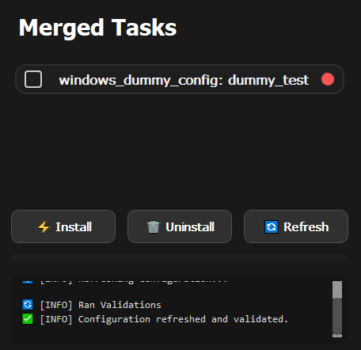

# Copystaller
Creates installations from .json files, executing and verifying OS cli commands.
A super simple program for copy and installing programs by defining which commands to run in a config.json file. See examples in ./example folder. A great tool for setting up certificates, mirrors and configs for local development environments. Logging all stages to file. 




# Run

For executables (.exe) see release.

Using python:
```bash
# Install packages
pip install -r ./requirements.txt
# Run program
python ./src/main.py
```

# Config
See example config below.

```json
{
    "projectname": "Dummy Test Task",
    "os": "linux",
    "tasks": [
        {
            "name": "dummy_test",
            "install": [
                "echo '=== Start dummy installation ==='",
                "echo 'Creating test file...'",
                "touch ./fil.txt",
                "echo 'File created successfully.'",
                "echo 'Simulating progress step 1'",
                "sleep 1",
                "echo 'Simulating progress step 2'",
                "sleep 1",
                "echo 'Installation complete!'"
            ],
            "validate": [
                "test -f ./fil.txt"
            ],
            "uninstall": [
                "echo 'Removing test file...'",
                "rm -f ./fil.txt",
                "echo 'Cleanup complete.'"
            ]
        }
    ]
}

```


# Tests
Vital and core functionality are tested with pytest. To run tests yourself enter `Test`-folder and run:
```cmd
pytest .
```

# License

This repository is using [MIT License](./LICENSE).

# Disclaimer
Much of the code in this repository is created using ChatGPT-5 mini.


@Grebtsew 2025